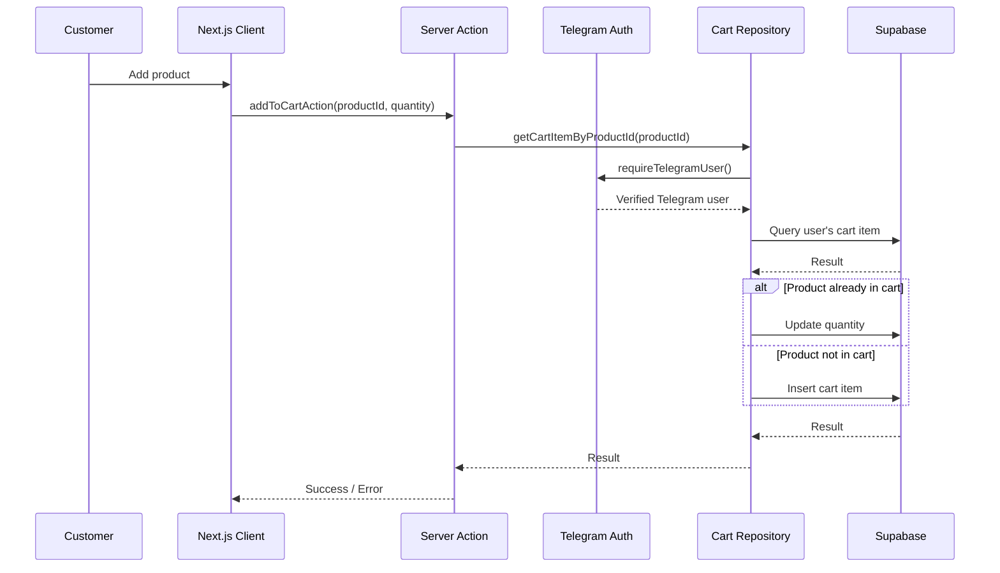

# API / Server Actions Reference

**Project:** Telegram Mini App E-commerce  
**Version:** MVP  
**Status:** In Development  
**Last Updated:** August 2026

---

# 1. Overview

The application does not currently expose a traditional public REST API.

Instead, customer mutations are implemented primarily through **Next.js Server Actions**.

The current server-side architecture is:

```text
Client Component
      │
      ▼
Server Action
      │
      ▼
Repository
      │
      ▼
Supabase
```

Telegram authentication is also handled through a Server Action.

---

# 2. Server Actions

Current application Server Actions:

| Action | File | Purpose |
|---|---|---|
| `syncTelegramSessionAction` | `src/app/actions/telegram.ts` | Authenticate and establish Telegram session |
| `clearTelegramSessionAction` | `src/app/actions/telegram.ts` | Remove Telegram session |
| `addToCartAction` | `src/app/actions/cart.ts` | Add/increment a product in the customer's cart |
| `updateQuantityAction` | `src/app/actions/cart.ts` | Change cart quantity or remove an item when quantity reaches zero |
| `removeFromCartAction` | `src/app/actions/cart.ts` | Remove a cart item |

---

# 3. `syncTelegramSessionAction`

**File:**

```text
src/app/actions/telegram.ts
```

## Purpose

Validates Telegram Mini App `initData` and establishes the customer's server-side Telegram session.

This is the entry point for Telegram identity.

---

## Input

```typescript
syncTelegramSessionAction(initData: string)
```

### `initData`

The raw value supplied by:

```typescript
window.Telegram.WebApp.initData
```

The server does not trust the client-provided Telegram user ID independently.

---

## Processing

```text
initData
   ↓
validateAndExtractUser()
   ↓
validateTelegramInitData()
   ↓
HMAC-SHA256 verification
   ↓
Verified Telegram user
   ↓
httpOnly cookie
```

The cookie name is:

```text
tg_init_data
```

---

## Output

Success:

```typescript
{
  success: true
}
```

Failure:

```typescript
{
  success: false,
  error: string
}
```

Possible validation failures include:

```text
Missing Telegram initData
Invalid Telegram initData
```

---

## Side Effects

On successful authentication, the action creates/updates an HTTP-only cookie:

```text
tg_init_data
```

with:

```text
httpOnly: true
secure: true in production
sameSite: lax
path: /
maxAge: 86400
```

---

# 4. `clearTelegramSessionAction`

**File:**

```text
src/app/actions/telegram.ts
```

## Purpose

Clears the customer's Telegram session cookie.

---

## Input

None.

```typescript
clearTelegramSessionAction()
```

---

## Output

```typescript
Promise<void>
```

---

## Side Effects

Deletes:

```text
tg_init_data
```

from the browser's cookies.

---

# 5. `addToCartAction`

**File:**

```text
src/app/actions/cart.ts
```

## Purpose

Adds a product to the authenticated Telegram user's cart.

If the product already exists in that customer's cart, its quantity is increased.

---

## Input

```typescript
addToCartAction(
  productId: string,
  quantity: number
)
```

### `productId`

The UUID of the product being added.

### `quantity`

The number of units to add.

---

## Processing

```text
addToCartAction()
       │
       ▼
getCartItemByProductId()
       │
       ├── Existing item
       │       ↓
       │   updateQuantity()
       │
       └── No existing item
               ↓
           addToCart()
```

The repository obtains the verified Telegram user before operating on the cart.

---

## User Isolation

The server determines the customer using the validated Telegram session.

The cart lookup is scoped to:

```text
product_id
AND
telegram_user_id
```

Therefore:

```text
User A + Product X
```

is independent from:

```text
User B + Product X
```

---

## Output

Success:

```typescript
{
  success: true
}
```

Failure:

```typescript
{
  success: false,
  error: string
}
```

---

## Error Handling

If Telegram authentication fails:

```text
Open this app in Telegram to manage your cart.
```

Repository/database failures are returned as errors.

---

## Side Effects

On successful completion:

```typescript
revalidatePath("/cart");
revalidatePath("/shop");
revalidatePath("/");
```

This invalidates cached server-rendered data for affected storefront pages.

---

# 6. `updateQuantityAction`

**File:**

```text
src/app/actions/cart.ts
```

## Purpose

Updates the quantity of an existing cart item.

If the requested quantity is zero or negative, the item is removed instead.

---

## Input

```typescript
updateQuantityAction(
  id: string,
  quantity: number
)
```

### `id`

The UUID of the cart item.

### `quantity`

Desired quantity.

---

## Processing

```text
quantity <= 0
       │
       ▼
removeFromCart()

quantity > 0
       │
       ▼
updateQuantity()
```

Both operations are scoped to the verified Telegram user.

---

## Output

Success:

```typescript
{
  success: true
}
```

Failure:

```typescript
{
  success: false,
  error: string
}
```

---

## Side Effects

On success:

```typescript
revalidatePath("/cart");
revalidatePath("/shop");
revalidatePath("/");
```

---

# 7. `removeFromCartAction`

**File:**

```text
src/app/actions/cart.ts
```

## Purpose

Removes a specific product from the authenticated customer's cart.

---

## Input

```typescript
removeFromCartAction(id: string)
```

### `id`

The cart item's UUID.

---

## Processing

```text
removeFromCartAction()
       ↓
requireTelegramUser()
       ↓
Verified Telegram User
       ↓
Delete cart item
WHERE
  id = supplied ID
AND
  telegram_user_id = verified user ID
```

The additional user condition protects against modifying another user's cart item by guessing or obtaining its UUID.

---

## Output

Success:

```typescript
{
  success: true
}
```

Failure:

```typescript
{
  success: false,
  error: string
}
```

---

## Side Effects

On success:

```typescript
revalidatePath("/cart");
revalidatePath("/shop");
revalidatePath("/");
```

---

# 8. Cart Repository Operations

Although these are not directly exposed as Server Actions, they form the server-side data-access layer behind the cart actions.

**File:**

```text
src/lib/repositories/cart.ts
```

Current operations:

| Function | Purpose |
|---|---|
| `addToCart()` | Insert or update a user's cart item |
| `getCartItems()` | Retrieve the current user's cart |
| `getCartItemByProductId()` | Find a product in the current user's cart |
| `removeFromCart()` | Delete a user's cart item |
| `updateQuantity()` | Update a user's cart quantity |
| `getCartCount()` | Return the number of cart rows for the user |

---

# 9. `addToCart()` Repository Function

```typescript
addToCart(
  productId: string,
  quantity: number
)
```

## Authentication

Uses:

```typescript
requireTelegramUser()
```

The resulting verified Telegram ID is used for database filtering.

---

## Database Behavior

First checks:

```text
product_id
+
telegram_user_id
```

If an item exists:

```text
existing quantity + requested quantity
```

If it does not exist:

```text
INSERT cart_items
```

with:

```text
product_id
quantity
telegram_user_id
```

---

# 10. `getCartItems()`

```typescript
getCartItems()
```

Retrieves cart items belonging to the currently authenticated Telegram user.

The query filters by:

```text
telegram_user_id = verifiedTelegramUserId
```

It also retrieves associated product information:

```text
products (
  id,
  name,
  image,
  price
)
```

---

## Unauthenticated Behavior

If no verified Telegram user exists:

```typescript
{
  success: true,
  data: [],
  error: null
}
```

This prevents an unauthenticated request from receiving another customer's cart.

---

# 11. `getCartItemByProductId()`

```typescript
getCartItemByProductId(productId)
```

Finds a cart item for:

```text
verified Telegram user
+
specified product
```

It does not perform a global product lookup across all customers.

---

# 12. `removeFromCart()`

```typescript
removeFromCart(id)
```

Deletes only when both conditions match:

```text
cart_items.id = id
AND
cart_items.telegram_user_id = verified user ID
```

This is an important authorization boundary.

---

# 13. `updateQuantity()`

```typescript
updateQuantity(
  id,
  quantity
)
```

Updates a cart item only when:

```text
id = supplied cart item ID
AND
telegram_user_id = verified user ID
```

---

# 14. `getCartCount()`

```typescript
getCartCount()
```

Returns the number of cart rows belonging to the verified Telegram user.

Example:

```typescript
{
  success: true,
  count: 3,
  error: null
}
```

If no Telegram user exists:

```typescript
{
  success: true,
  count: 0,
  error: null
}
```

---

# 15. Authentication / Authorization Functions

The Telegram identity layer contains the following important server functions.

### `validateTelegramInitData()`

**File:**

```text
src/lib/telegram/validate-init-data.ts
```

Purpose:

- Validate Telegram `initData`
- Verify HMAC-SHA256 signature
- Validate `auth_date`
- Extract Telegram user information

It returns either validated identity information or `null`.

---

### `getTelegramUser()`

**File:**

```text
src/lib/telegram/get-telegram-user.ts
```

Purpose:

1. Check development bypass when explicitly enabled
2. Read `tg_init_data`
3. Validate the stored Telegram data
4. Return the verified Telegram user

Returns:

```typescript
TelegramUser | null
```

---

### `requireTelegramUser()`

Purpose:

Require a valid Telegram identity.

If validation fails, it throws:

```text
TelegramAuthError
```

This is used by protected cart mutations.

---

# 16. Error Handling Model

The application uses a simple Server Action result structure.

### Success

```typescript
{
  success: true
}
```

### Failure

```typescript
{
  success: false,
  error: string
}
```

Telegram authentication errors are converted into user-friendly messages.

For example:

```text
Open this app in Telegram to manage your cart.
```

Unexpected failures are intentionally generalized:

```text
Something went wrong. Please try again.
```

This prevents internal database/server errors from unnecessarily being exposed to customers.

---

# 17. Current API/Action Data Flow



---

# 18. Current API Boundary

The current application intentionally does **not** expose:

```text
POST /api/cart
GET /api/cart
PATCH /api/cart/:id
DELETE /api/cart/:id
```

Instead, cart operations are implemented through Server Actions.

This reduces the amount of publicly exposed API surface for the MVP.

---

# 19. Planned Order/Checkout Actions

The database foundation for:

```text
orders
order_items
```

already exists.

However, the following actions have **not yet been confirmed as implemented**:

```text
createOrder()
createOrderItem()
checkout()
confirmOrder()
processPayment()
```

These should be documented here only after they are actually implemented.

`[CONFIRM: update this section when checkout/order Server Actions are created.]`

---

# 20. Planned Checkout Flow

The intended future Server Action flow is:

```text
Customer Cart
      ↓
Checkout
      ↓
Validate Telegram Identity
      ↓
Validate Cart
      ↓
Validate Stock
      ↓
Create Order
      ↓
Create Order Items
      ↓
Process/Initiate Payment
      ↓
Update Order Status
      ↓
Clear Cart
      ↓
Customer Confirmation
```

The exact payment integration and order status model remain:

```text
[CONFIRM: payment provider]
[CONFIRM: final order status values]
```

---

# 21. Server-Side Security Principles

All protected customer operations follow these rules:

1. Never trust a client-supplied Telegram user ID.
2. Validate Telegram `initData` server-side.
3. Derive the user ID from the verified Telegram identity.
4. Keep the Supabase Service Role key server-side.
5. Scope every cart operation to the verified user.
6. Do not expose `cart_items` through the public Supabase client.
7. Do not expose internal database errors unnecessarily to customers.
8. Protect update/delete operations against IDOR by including the Telegram user ID in the database filter.

These principles should remain intact as checkout and orders are implemented.