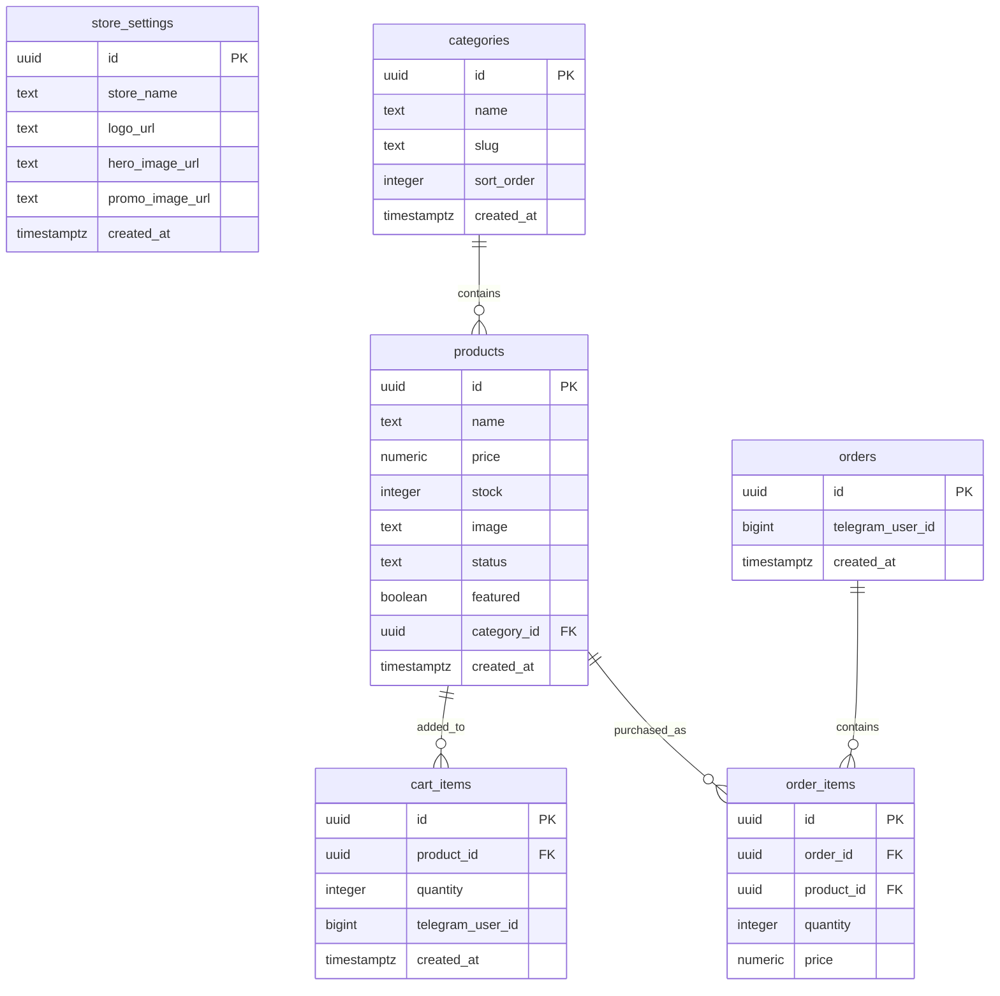
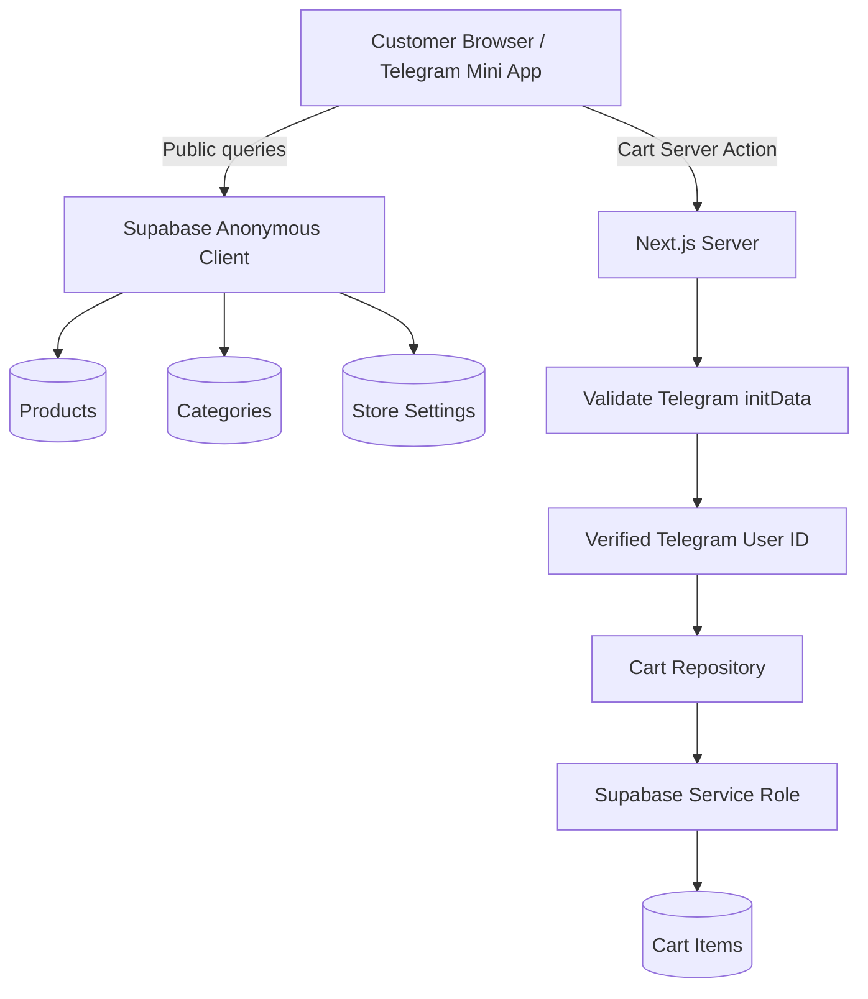

# Database Schema Documentation

**Project:** Telegram Mini App E-commerce  
**Version:** MVP  
**Database:** PostgreSQL via Supabase  
**Status:** In Development  
**Last Updated:** August 2026

---

## 1. Database Overview

The application uses **Supabase PostgreSQL** as its primary persistent data store.

The database currently contains the following core tables:

- `store_settings`
- `categories`
- `products`
- `cart_items`
- `orders`
- `order_items`

The database supports three primary domains:

```text
Store Configuration
        │
        ├── store_settings
        │
        └── categories
                │
                ▼
             products
                │
                ▼
           cart_items
                │
                ▼
              orders
                │
                ▼
           order_items
```

---

# 2. Entity Relationship Diagram



> **Schema confirmation note:** The exact complete column definitions for `orders` and `order_items` were not included in the schema output shared during development. Their fields above therefore represent the fields confirmed by the generated TypeScript relationships plus the current implementation context. `[CONFIRM: compare orders/order_items fields against the current Supabase schema before treating those sections as authoritative.]`

---

# 3. `store_settings`

Stores configuration and visual content for the boutique storefront.

| Column | Type | Nullable | Default |
|---|---|---:|---|
| `id` | `uuid` | No | `gen_random_uuid()` |
| `store_name` | `text` | No | — |
| `logo_url` | `text` | No | — |
| `hero_image_url` | `text` | No | — |
| `created_at` | `timestamptz` | No | `now()` |
| `promo_image_url` | `text` | No | — |

### Purpose

Provides storefront-level configuration such as:

- Store name
- Logo
- Hero image
- Promotional image

### Relationships

None currently confirmed.

---

# 4. `categories`

Stores product categories displayed by the storefront.

| Column | Type | Nullable | Default |
|---|---|---:|---|
| `id` | `uuid` | No | `gen_random_uuid()` |
| `name` | `text` | No | — |
| `created_at` | `timestamptz` | No | `now()` |
| `slug` | `text` | No | — |
| `sort_order` | `integer` | No | `0` |

### Purpose

Categories allow customers to organize and filter products.

Examples could include:

- Dresses
- Shirts
- Pants
- Shoes

The actual production category values are managed by the boutique.

### Relationship

```text
categories.id
      │
      ▼
products.category_id
```

One category can contain multiple products.

---

# 5. `products`

Stores the products available in the storefront.

| Column | Type | Nullable | Default |
|---|---|---:|---|
| `id` | `uuid` | No | `gen_random_uuid()` |
| `name` | `text` | No | — |
| `price` | `numeric` | No | — |
| `stock` | `integer` | No | `0` |
| `image` | `text` | No | — |
| `status` | `text` | No | `'active'` |
| `created_at` | `timestamptz` | No | `now()` |
| `featured` | `boolean` | No | `false` |
| `category_id` | `uuid` | No | `gen_random_uuid()` |

### Purpose

Represents products displayed to customers.

The storefront currently uses product information for:

- Product listing
- Search
- Category filtering
- Product details
- Pricing
- Stock status
- Featured products
- Cart display

### Relationships

```text
categories.id
      │
      └────── products.category_id

products.id
      │
      ├────── cart_items.product_id
      │
      └────── order_items.product_id
```

---

# 6. `cart_items`

Stores products currently in a customer's cart.

This is the most security-sensitive customer table currently implemented.

| Column | Type | Nullable | Default |
|---|---|---:|---|
| `id` | `uuid` | No | `gen_random_uuid()` |
| `product_id` | `uuid` | No | `gen_random_uuid()` |
| `quantity` | `integer` | No | `1` |
| `created_at` | `timestamptz` | No | `now()` |
| `telegram_user_id` | `bigint` | No | `[CONFIRM]` |

`telegram_user_id` was added specifically to associate each cart item with its Telegram customer.

---

## 6.1 Cart Ownership

Cart ownership is determined by:

```text
telegram_user_id
```

The application obtains this value from the **server-validated Telegram Mini App identity**.

The browser does not choose the Telegram user ID for cart operations.

The server:

```text
Telegram initData
       ↓
HMAC validation
       ↓
Verified Telegram user
       ↓
user.id
       ↓
cart_items.telegram_user_id
```

---

## 6.2 Cart Uniqueness

A unique index was added:

```sql
create unique index if not exists cart_items_user_product_unique
on public.cart_items (telegram_user_id, product_id);
```

Therefore, the same Telegram user cannot have two separate cart rows for the same product.

Conceptually:

```text
UNIQUE (
    telegram_user_id,
    product_id
)
```

This allows:

```text
User A + Product X
User B + Product X
```

while preventing:

```text
User A + Product X
User A + Product X
```

---

# 7. `orders`

Stores customer orders.

Orders are the next transactional layer above the cart.

The application has already established the database foundation for orders and `order_items`, but the complete customer checkout flow is still being implemented.

### Confirmed relationship

```text
orders.id
     │
     ▼
order_items.order_id
```

One order can contain multiple order items.

### Customer identity

The intended architecture associates an order with the Telegram customer:

```text
orders.telegram_user_id
```

`[CONFIRM: verify the exact current orders column definition in Supabase.]`

---

# 8. `order_items`

Stores the individual products belonging to an order.

Confirmed relationships include:

```text
order_items.order_id
        │
        ▼
orders.id
```

and:

```text
order_items.product_id
        │
        ▼
products.id
```

This allows an order to represent multiple products.

Example:

```text
Order #123
│
├── Product A × 2
├── Product B × 1
└── Product C × 3
```

`[CONFIRM: verify the complete current column list, data types, defaults, and constraints in Supabase.]`

---

# 9. Foreign-Key Relationships

The confirmed relationships are:

### Category → Products

```text
categories.id
        ↓
products.category_id
```

One category can have many products.

### Product → Cart Items

```text
products.id
        ↓
cart_items.product_id
```

A product can appear in multiple customers' carts.

### Order → Order Items

```text
orders.id
        ↓
order_items.order_id
```

One order contains multiple order items.

### Product → Order Items

```text
products.id
        ↓
order_items.product_id
```

A product can appear in many historical orders.

---

# 10. Row Level Security

## 10.1 Public Storefront Tables

The currently confirmed policies are:

### `categories`

```text
Policy: categories_policy
Command: SELECT
Role: public
Condition: true
```

This permits public reading of categories.

### `products`

```text
Policy: public_read_products
Command: SELECT
Role: public
Condition: true
```

This permits public reading of products.

### `store_settings`

```text
Policy: store_settings_policy
Command: SELECT
Role: public
Condition: true
```

This permits public reading of storefront settings.

---

# 11. Cart RLS

The cart security model intentionally differs from the public storefront tables.

RLS is enabled on:

```text
cart_items
```

Existing cart policies were removed:

```sql
drop policy if exists "cart_items_select_own"
on public.cart_items;

drop policy if exists "cart_items_insert_own"
on public.cart_items;

drop policy if exists "cart_items_update_own"
on public.cart_items;

drop policy if exists "cart_items_delete_own"
on public.cart_items;
```

Direct access for:

```text
anon
authenticated
```

is revoked:

```sql
revoke all
on table public.cart_items
from anon, authenticated;
```

### Result

The browser cannot directly access `cart_items` using the public Supabase client.

Cart access follows:

```text
Telegram
   ↓
Next.js
   ↓
Validated Telegram identity
   ↓
Service-role Supabase client
   ↓
cart_items
```

---

# 12. Service Role Access

The server creates a Supabase client using:

```text
SUPABASE_SERVICE_ROLE_KEY
```

This client is located in server-only code.

The service role bypasses PostgreSQL RLS, so **application-level user scoping is mandatory**.

Every cart query therefore includes:

```text
telegram_user_id = verified Telegram user ID
```

For example:

```text
.eq("telegram_user_id", user.id)
```

This is applied to:

- Cart lookup
- Cart insertion
- Cart updates
- Cart deletion
- Cart count

---

# 13. Security Model

The current security boundary is:



The important rule is:

> **The client never determines whose cart is being accessed. The server derives the Telegram user ID from verified Telegram identity.**

---

# 14. Current Database Security Status

| Table | Public Read | Direct Public Write | RLS | Current Access Model |
|---|---:|---:|---:|---|
| `store_settings` | Yes | No | Policy-based | Public storefront |
| `categories` | Yes | No | Policy-based | Public storefront |
| `products` | Yes | No | Policy-based | Public storefront |
| `cart_items` | No | No | Enabled | Next.js + Service Role |
| `orders` | `[CONFIRM]` | `[CONFIRM]` | `[CONFIRM]` | Admin/checkout foundation |
| `order_items` | `[CONFIRM]` | `[CONFIRM]` | `[CONFIRM]` | Checkout foundation |

---

# 15. Important Current Limitation

The database schema supports the application's next major feature—orders—but the full transaction flow has not yet been completed.

The intended flow is:

```text
Customer
   ↓
Cart
   ↓
Checkout
   ↓
Create Order
   ↓
Create Order Items
   ↓
Payment / Order Confirmation
   ↓
Admin Dashboard
```

The exact payment provider and final order status model remain:

```text
[CONFIRM: payment provider]
[CONFIRM: order status values]
```

---

# 16. Data Ownership Model

The MVP currently follows this ownership model:

### Store-owned data

```text
store_settings
categories
products
```

Managed by the boutique/admin system.

### Customer-owned data

```text
cart_items
orders
```

Associated with the customer's verified Telegram identity.

### Transaction data

```text
order_items
```

Represents the products captured at the time of an order.

---

# 17. Design Principle

The database is intentionally simple for the first boutique deployment.

The schema is designed around the core business hypothesis:

> **Boutique owners already have an audience on Telegram. The Mini App should turn that existing audience into customers with as little friction as possible.**

The database therefore prioritizes:

- Simple product management
- Fast storefront reads
- Telegram-based customer identity
- Isolated customer carts
- Straightforward order creation
- A foundation for future checkout and payment processing

It does not currently attempt to implement a complex multi-vendor marketplace or full customer-account platform.