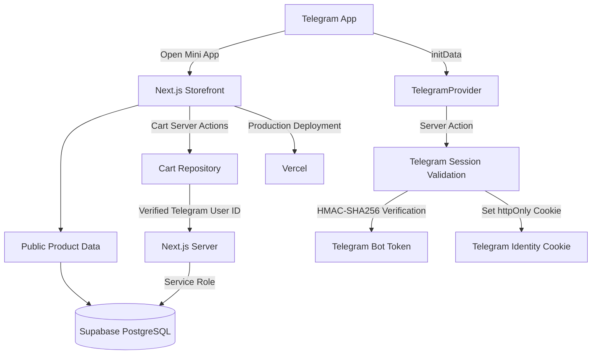
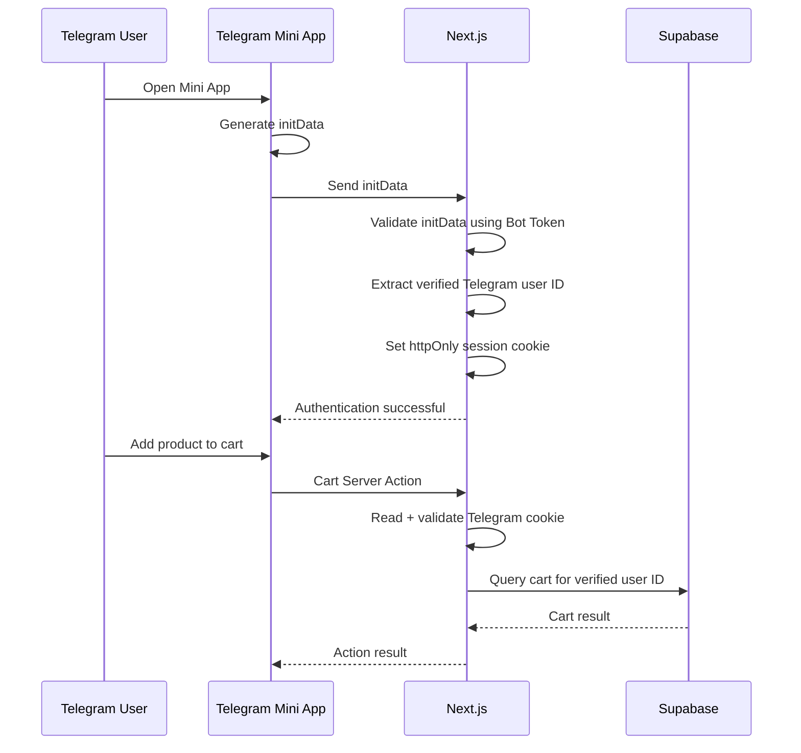
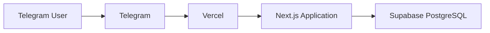

# System Architecture Document

**Project:** Telegram Mini App E-commerce  
**Version:** MVP  
**Status:** In Development  
**Last Updated:** August 2026

---

## 1. Architecture Overview

The application is a Telegram Mini App storefront designed to allow Ethiopian boutique businesses to turn their existing Telegram channel audiences into customers.

The system uses:

- **Telegram Mini Apps** for the customer-facing entry point
- **Next.js 16** for the web application and server-side logic
- **Supabase PostgreSQL** for persistent application data
- **Supabase Service Role** for protected server-side cart operations
- **Vercel** for production deployment
- **Telegram `initData`** as the customer identity mechanism

The application is intentionally designed as a lightweight MVP. Telegram serves as the primary customer environment rather than requiring users to create a separate account.

---

## 2. High-Level Architecture



---

## 3. Client Application

### 3.1 Telegram Mini App

The storefront is launched inside Telegram through a bot configured using **BotFather**.

Telegram provides the Mini App with:

```text
window.Telegram.WebApp
```

The application primarily uses:

```text
window.Telegram.WebApp.initData
```

for authenticated Telegram identity.

The application does **not** trust:

```text
initDataUnsafe.user.id
```

for server-side authorization.

Instead, the raw `initData` is sent to the Next.js server where it is cryptographically validated.

---

## 4. Next.js Application

Next.js acts as both:

1. The customer-facing frontend
2. The secure server-side application layer

### Major application areas

```text
src/
├── app/
│   ├── actions/
│   │   ├── cart.ts
│   │   └── telegram.ts
│   │
│   ├── admin/
│   │   ├── login/
│   │   ├── dashboard/
│   │   ├── categories/
│   │   └── orders/
│   │
│   ├── cart/
│   ├── shop/
│   └── ...
│
├── components/
│   ├── TelegramProvider.tsx
│   ├── AddToCartButton.tsx
│   ├── CartClient.tsx
│   ├── BottomNavigation.tsx
│   └── ...
│
├── lib/
│   ├── repositories/
│   │   └── cart.ts
│   │
│   ├── telegram/
│   │   ├── get-telegram-user.ts
│   │   ├── validate-init-data.ts
│   │   ├── types.ts
│   │   └── errors.ts
│   │
│   ├── supabase.ts
│   └── supabase-server.ts
│
└── types/
    └── database.ts
```

---

## 5. Data Access Architecture

The application deliberately separates **public storefront data** from **protected customer data**.

### Public data

Products, categories, and store settings are publicly readable.

The application can use the Supabase anonymous client for this data.

```text
Next.js Client/Server
        │
        ▼
Supabase Anonymous Client
        │
        ▼
Products / Categories / Store Settings
```

### Protected cart data

Cart data cannot be accessed directly through the browser's Supabase anonymous client.

Instead:

```text
Browser
   │
   ▼
Next.js Server Action
   │
   ▼
Validate Telegram Cookie
   │
   ▼
Extract Telegram User ID
   │
   ▼
Cart Repository
   │
   ▼
Supabase Service Role Client
   │
   ▼
cart_items
```

This prevents users from directly querying the cart table through the public Supabase API.

---

## 6. Telegram Authentication Flow

Telegram authentication is implemented without Supabase Auth.

### Flow



---

## 7. Telegram `initData` Validation

The server validates Telegram's `initData` using the official Telegram verification algorithm.

The validation process:

1. Receive raw `initData`
2. Parse the query parameters
3. Extract `hash`
4. Extract `auth_date`
5. Extract Telegram user information
6. Construct the Telegram data-check string
7. Generate the secret key using the bot token
8. Generate the expected HMAC-SHA256 hash
9. Compare the calculated hash against Telegram's hash
10. Reject expired or invalid data
11. Return the verified Telegram user

The current implementation considers authentication data older than **24 hours** invalid.

---

## 8. Session Architecture

After successful validation, the raw Telegram `initData` is stored in an HTTP-only cookie:

```text
tg_init_data
```

Cookie characteristics:

```text
httpOnly: true
secure: true in production
sameSite: lax
path: /
maxAge: 86400 seconds
```

On subsequent protected operations, the server:

```text
Cookie
  ↓
validateTelegramInitData()
  ↓
Verified Telegram User
  ↓
user.id
```

The Telegram user ID is therefore the application's current customer identity.

---

## 9. Cart Isolation Architecture

Each cart item contains:

```text
telegram_user_id
```

Cart queries are always scoped to the verified Telegram user.

For example:

```text
WHERE telegram_user_id = verifiedTelegramUserId
```

The cart repository applies this restriction to:

- Cart lookup
- Cart insertion
- Cart updates
- Cart deletion
- Cart count

The `cart_items` table also has a unique constraint/index on:

```text
(telegram_user_id, product_id)
```

This prevents the same product from being inserted as multiple separate cart rows for the same Telegram user.

---

## 10. Supabase Security Model

The `cart_items` table has Row Level Security enabled.

Direct access for:

```text
anon
authenticated
```

is revoked.

Therefore:

```text
Browser → Supabase cart_items
```

is intentionally blocked.

Cart access instead uses the server-side Supabase Service Role client.

### Important security boundary

The service role key is **never exposed to client-side code**.

It is accessed only through:

```text
process.env.SUPABASE_SERVICE_ROLE_KEY
```

inside server-only code.

The server client explicitly uses:

```text
import "server-only";
```

---

## 11. Supabase Architecture

Supabase provides the PostgreSQL database and API layer.

Current major data domains include:

```text
Store
 ├── store_settings
 ├── categories
 ├── products
 │
Customer
 ├── cart_items
 │
Orders
 ├── orders
 └── order_items
```

Products and categories support the public storefront.

Cart and order functionality represents customer-specific transactional data.

---

## 12. Repository Pattern

Database operations are separated from UI components through repositories.

Example:

```text
Component
    ↓
Server Action
    ↓
Repository
    ↓
Supabase
```

For cart functionality:

```text
AddToCartButton
       ↓
addToCartAction()
       ↓
cart repository
       ↓
createServiceRoleClient()
       ↓
Supabase
```

This separation keeps database logic out of the presentation layer and makes the application easier to maintain as the MVP expands.

---

## 13. Optimistic UI

The cart uses React's optimistic UI functionality.

`CartClient` uses:

```text
useOptimistic()
useTransition()
```

This allows quantity changes and deletions to update the interface immediately while the server operation is running.

The application then refreshes the server-rendered data after the operation completes.

---

## 14. Deployment Architecture

Production deployment currently uses Vercel.



### Production flow

```text
Telegram
    ↓
Mini App URL
    ↓
Vercel
    ↓
Next.js
    ↓
Supabase
```

The Telegram bot's Mini App URL points to the deployed Vercel application.

---

## 15. Environment Configuration

The application currently relies on the following environment variables:

### Public

```env
NEXT_PUBLIC_SUPABASE_URL=
NEXT_PUBLIC_SUPABASE_ANON_KEY=
```

These are safe to expose to the browser because they identify the Supabase project and use the anonymous role.

### Server-only

```env
TELEGRAM_BOT_TOKEN=
SUPABASE_SERVICE_ROLE_KEY=
```

These must remain server-side.

The following must **never** be prefixed with `NEXT_PUBLIC_`:

```text
TELEGRAM_BOT_TOKEN
SUPABASE_SERVICE_ROLE_KEY
```

---

## 16. Current Architecture Decisions

| Decision                                   | Reason                                                              |
| ------------------------------------------ | ------------------------------------------------------------------- |
| Telegram Mini App                          | Reduce friction for existing Telegram audiences                     |
| Telegram identity                          | Avoid requiring customers to create separate accounts               |
| Next.js Server Actions                     | Secure server-side mutations                                        |
| Supabase                                   | PostgreSQL database + API                                           |
| Service Role for protected cart operations | Allows server-controlled access while blocking direct client access |
| Telegram HMAC validation                   | Verify Telegram identity server-side                                |
| HTTP-only cookie                           | Maintain verified Telegram session                                  |
| Repository pattern                         | Separate database logic from UI                                     |
| Vercel                                     | Simple Next.js deployment                                           |
| Optimistic UI                              | Improve perceived responsiveness                                    |

---

## 17. MVP Architecture Boundary

### Currently in scope

- Telegram Mini App storefront
- Product browsing
- Categories
- Product details
- Search
- Customer cart
- Telegram-based customer identity
- Cart isolation
- Orders database foundation
- Order items database foundation
- Admin dashboard foundation

### Planned next

- Checkout
- Order creation from cart
- Customer order confirmation
- Admin order management
- Telegram Mini App SDK/API integration refinements

### Explicitly not required for the first MVP

- Independent customer account system
- Full traditional e-commerce website
- Complex customer profiles
- Multi-vendor architecture
- Advanced recommendation engine
- Native mobile application
- Payment integration

---

## 18. Architectural Principle

The central architectural principle of the MVP is:

> **Telegram is the customer entry point and identity layer, while Next.js provides the secure application layer and Supabase provides persistent storage.**

The system is intentionally optimized for one boutique deployment first. The goal is to validate whether reducing the friction between a boutique's Telegram audience and its purchasing process results in more completed orders before investing in a larger multi-store platform.
